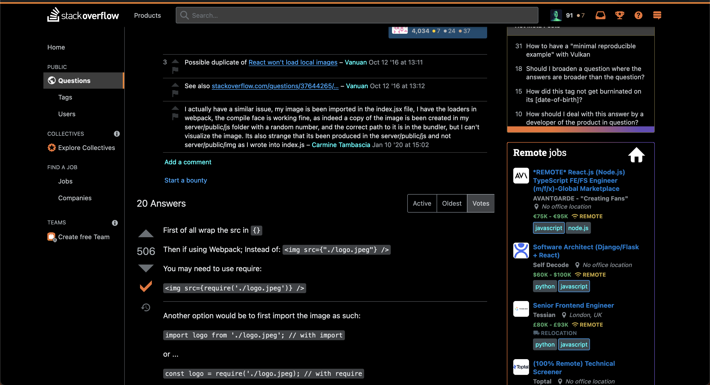
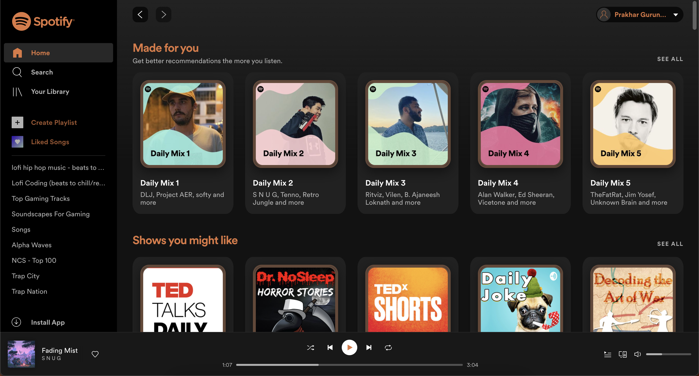
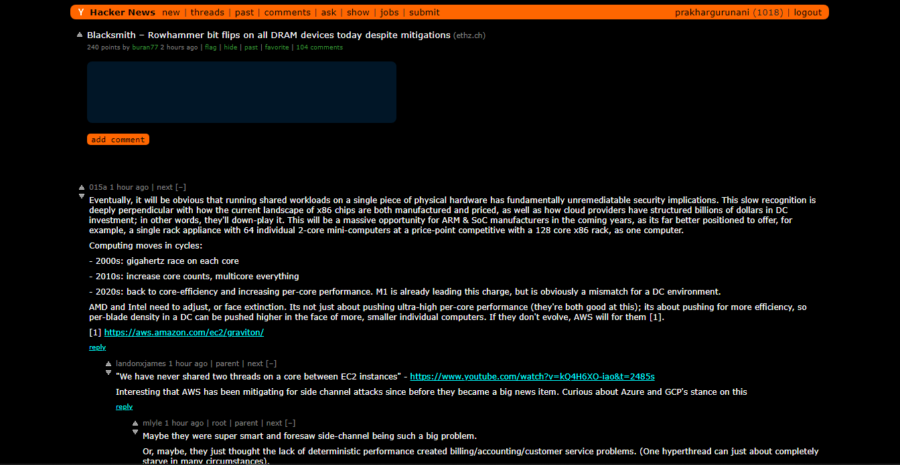
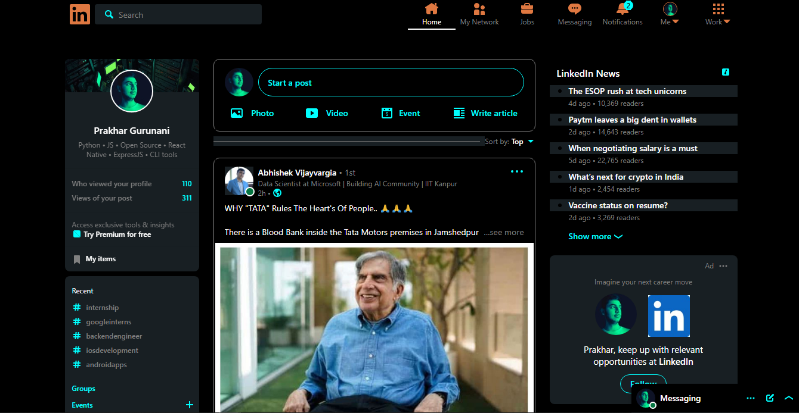

# Dotfiles

These are config files to set up a system the way I like it. I am running on Mac OS, but it will likely work on Linux as well.

## Stack Overflow

## Spotify

## Hacker News

## Linkedin

