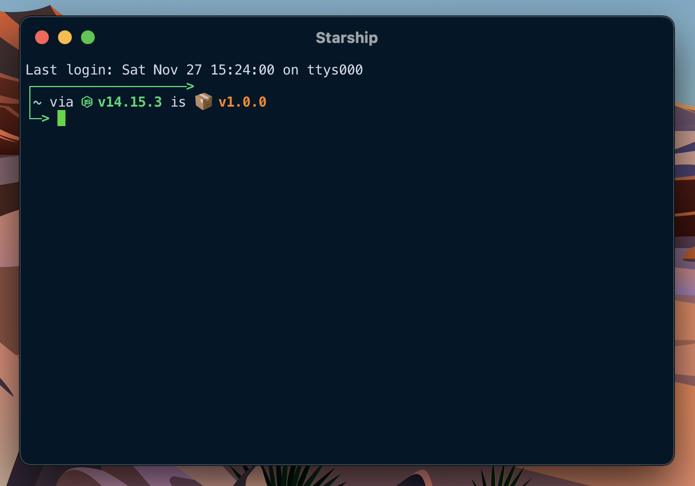

# Dotfiles

These are config files to set up a system the way I like it. I am running on Mac OS, but it will likely work on Windows and Linux as well.

## VS Code

## iTerm2

## Stack Overflow

## Spotify

## Hacker News

## Linkedin (WIP)

